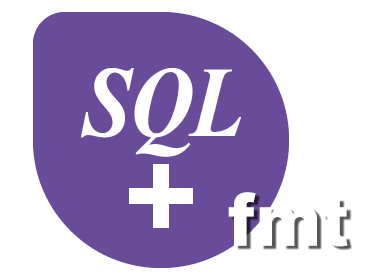

<p align="center">
    
    <p align="center">
        An Aspen SQLplus CLI formatter built in Rust
    </p>
</p>

This project provides a command-line interface (CLI) for formatting Aspen SQLplus code, using the `aspensqlplus-fmt` Rust crate. With this tool, you can easily format your SQLplus scripts to adhere to a consistent style.

> Disclaimer: This project is not affiliated with AspenTech.

This workspace contains:

- `formatter/`: a Rust CLI `aspensqlplus-fmt` that formats Aspen SQLplus code.
- `vscode-extension/`: a VS Code extension that integrates the formatter.

Defaults:

- Uppercase SQL keywords
- Line width: 88
- Indentation: 2 spaces (configurable to 4)

## Configuration

Extension settings (in VS Code):

- `aspensqlFmt.path`: optional path to the `aspensqlplus-fmt` executable
- `aspensqlFmt.lineWidth`: default 88
- `aspensqlFmt.indent`: 2 or 4
- `aspensqlFmt.uppercaseKeywords`: true/false

## CLI usage

Pipe from stdin:

```powershell
Get-Content .\query.sql | .\formatter\target\release\aspensqlplus-fmt.exe
```

Format a file in place:

```powershell
.\formatter\target\release\aspensqlplus-fmt.exe --write .\query.sql
```

# Development

## Build the formatter (Rust)

1. Install [Rust](https://rustup.rs/)
2. Build release:

```powershell
cd formatter; cargo build --release
```

The executable will be at `formatter/target/release/aspensqlplus-fmt(.exe)`.

## Develop the VS Code extension

1. Install [Node.js 18+](https://nodejs.org/).
2. Install dependencies:

   ```powershell
   cd vscode-extension; npm install
   ```

3. Build once or watch:

   ```powershell
   npm run build
   # or
   npm run watch
   ```

4. Launch the Extension Development Host (Run and Debug in VS Code).

## Acknowledgments

This project is based on Astral's Python formatter [ruff](https://github.com/astral-sh/ruff).
